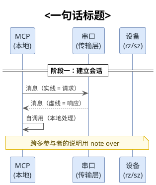
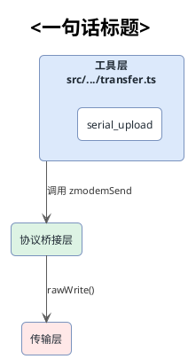

# Skill: PlantUML 画图与 SVG 渲染

用 PlantUML 绘制技术文档配图（架构图、时序图、流程图等），用自带脚本 `scripts/render-puml.mjs`（调用 PlantUML 在线服务）把 `.puml` 渲染成 SVG，嵌入 Markdown 文档。本 skill 固化了在线渲染下的一系列限制与避坑方案，可直接套用。

## 何时触发

当用户提出以下请求时激活：

- "帮我画一张架构图/时序图/流程图"
- "把这个 ASCII 图转成 plantuml/svg"
- "puml 转 svg"、"plantuml 渲染"
- "文档里加几张图"、"给文档配图"
- 直接提到 "plantuml"、"puml"、"uml"

## 工作流程

### 第 1 步：确定目录约定

遵循"一篇文档 + 同级同名资源目录"的约定（与 markdowncli 配合）。**md 文档在哪里，同名资源目录就在同级**，不限定是 `docs/`，只要 md 与资源目录是同级兄弟关系即可：

```
<任意目录>/某主题.md               ← 文档正文（引用 ./某主题/img/xxx.svg）
<任意目录>/某主题/                 ← 同名资源目录（与 md 同级、同名去掉 .md）
  ├── layered-architecture.puml   ← 源文件（必须保留, 便于改图重渲染）
  ├── session-handshake.puml
  └── img/                        ← SVG 输出目录(脚本默认写这里)
      ├── layered-architecture.svg
      └── session-handshake.svg
```

实例（不同项目里位置不同，但结构一致）：

```
docs/MCP无状态架构演进.md          docs/MCP无状态架构演进/{*.puml, img/*.svg}
docs/串口ZMODEM文件传输设计.md     docs/串口ZMODEM文件传输设计/{*.puml, img/*.svg}
README.md                          README/{*.puml, img/*.svg}     ← 根目录文档也适用
```

- md 文档与资源目录是**同级兄弟**，目录名 = md 文件名去掉 `.md`
- `.puml` 与 `img/*.svg` **同名**，便于对照
- 文档中用相对路径引用：``（`./` 指向同级同名目录）

### 第 2 步：写 .puml 源文件

按下文的**统一皮肤**和**图类型模板**编写。每个 `.puml` 必须以 `@startuml` 开头、`@enduml` 结尾。

两个语法要点（模板里已体现，写图时遵守）：

- **中文标签手动 `\n` 换行**：在线渲染对中文不做自动换行，长标签会撑破方框。例：`rectangle "createReadStream\n分块 8KiB" as f2`
- **`together{}` 内先定义节点再写箭头**：箭头夹在节点定义之间会 HTTP 400，应把所有节点定义放前、箭头统一放后

### 第 3 步：渲染成 SVG

```bash
# 渲染某 md 文档对应的同名资源目录下的所有 puml
node scripts/render-puml.mjs 某主题/*.puml

# 指定输出目录（默认: 各 puml 同级的 img/，即 <资源目录>/img/）
node scripts/render-puml.mjs 某主题/foo.puml --out-dir ./out-img

# 禁用 @inject:divider 后处理
node scripts/render-puml.mjs 某主题/foo.puml --no-dividers
```

脚本位置：本 skill 的 `scripts/render-puml.mjs`。它是零依赖的 ESM 脚本（仅用 Node 内置模块），复制到任意项目即可用。输出每个 SVG 时打印 `✓ xxx.puml → img/xxx.svg (NNN bytes)`，失败打印 `✗`。

### 第 4 步：嵌入文档

把渲染出的 SVG 用相对路径嵌入 Markdown：

```markdown

```

## 统一皮肤（强制套用，保证视觉一致）

每张图开头都加这套 skinparam（基于 `!theme plain` + 白底 + Segoe UI + 蓝色系）。时序图、组件图、活动图各自的皮肤片段见下文模板。

通用配色语义：

| 颜色 | 用途 |
|---|---|
| `#FFFFFF` | 背景底色 |
| `#7A93BE` | 边框主色（矩形/参与者/生命线/分组框） |
| `#DCE9FB` | 浅蓝底——主参与者/容器（如 MCP、本地侧） |
| `#DDF3E4` | 浅绿底——中间层（如串口、传输层） |
| `#FFF3D6` | 浅黄底——第三方库/外部设备（如 zmodem.js、设备端） |
| `#F7F9FC` | 极浅蓝底——普通处理节点（rectangle/activity 矩形） |
| `#FFFBE6` / `#E0B400` / `#5C4A00` | 黄色便签（note）的底/边/字 |
| `#5A5A5A` / `#333333` | 箭头线/箭头标签字 |

## 图类型模板

### 1. 时序图（sequence）——最稳定，优先用于"交互/往返/角色通信"



### 2. 组件/结构图（component/rectangle）——用于"分层/拓扑"



### 3. 活动图（activity beta）——用于"流程/分支/循环"

```plantuml
@startuml 标题
!theme plain
skinparam backgroundColor #FFFFFF
skinparam shadowing false
skinparam roundCorner 10
skinparam defaultFontName "Segoe UI"
skinparam ArrowColor #5A5A5A
skinparam ArrowFontColor #333333
skinparam ArrowFontSize 11
skinparam ActivityBackgroundColor #F7F9FC
skinparam ActivityBorderColor #7A93BE
skinparam ActivityFontColor #1F2933
skinparam ActivityDiamondBackgroundColor #FFF3D6
skinparam ActivityDiamondBorderColor #E0B400
skinparam NoteBackgroundColor #FFFBE6
skinparam NoteBorderColor #E0B400
skinparam NoteFontColor #5C4A00

title <一句话标题>

start
:步骤一;
if (条件?) then (是)
  :分支 A;
else (否)
  :分支 B;
endif
stop

@enduml
```



> **注意：活动图的空白小菱形**。`if/elseif/else` 和 `repeat...repeat while` 的每个分支汇合处，PlantUML 会渲染一个 24×24 的**空白小菱形**（分支收束点，无判断语义）。这是 beta activity 的固有行为，非 bug。用 legend 加图例说明即可（legend 块用 `endlegend` 收尾，**不是** `end note`）：
>
> ```plantuml
> legend right
>   |= 形状 |= 含义 |
>   | 带文字菱形 | 判断节点 (if/while 条件) |
>   | 空白小菱形 | 分支汇合点 (无判断语义, 仅收束多分支) |
> endlegend
> ```

## 图类型选择决策表

| 要表达的内容 | 首选图类型 | 备注 |
|---|---|---|
| 多角色之间的消息往返（请求/响应） | **时序图** | 最稳定，天然适合"通信" |
| 分层架构、模块拓扑、包含关系 | **组件图（rectangle）** | 嵌套 rectangle 表达层级 |
| 流程、分支、循环 | **活动图** | 分支汇合处的空菱形用 legend 说明 |
| 两个方案对比 | **组件图 + @inject:divider** | 中间虚线分隔 |
| 状态转换 | **状态图（state）** | 未实测限制, 谨慎 |

## render-puml.mjs 脚本说明

- **位置**：`scripts/render-puml.mjs`（零依赖 ESM，仅用 Node 内置 `fs/path/zlib/https`）
- **原理**：实现 PlantUML 编码算法（UTF-8 → raw deflate → 自定义 base64），拼成 `plantuml.com/plantuml/svg/<encoded>` URL，GET 取回 SVG
- **输出**：默认写到每个 puml 同级的 `img/`；`--out-dir` 统一覆盖
- **后处理**：默认开启 `@inject:divider` 注入；`--no-dividers` 关闭
- **用法**：

  ```bash
  node scripts/render-puml.mjs <puml> [puml...] [--out-dir <dir>] [--no-dividers]
  ```

复制到目标项目后即可用，无需 `npm install`。

## 注意事项

- **保留 .puml 源文件**：SVG 是产物，改图要改源再重渲染。不要手改 SVG。
- **编码算法固定**：PlantUML 用自定义字符集 `0-9A-Za-z` 在前（非标准 base64），勿改 `ALPHABET`。
- **在线服务局限**：无法本地校验语法，错误只能通过 HTTP 400 或返回非 SVG 反馈。复杂图建议先用最小用例验证语法再加内容。
- **回归验证**：改了脚本逻辑后，重渲染既有 puml 并 `diff` 旧 SVG，确认字节一致（输出路径/编码/divider 逻辑不应产生 diff）。
